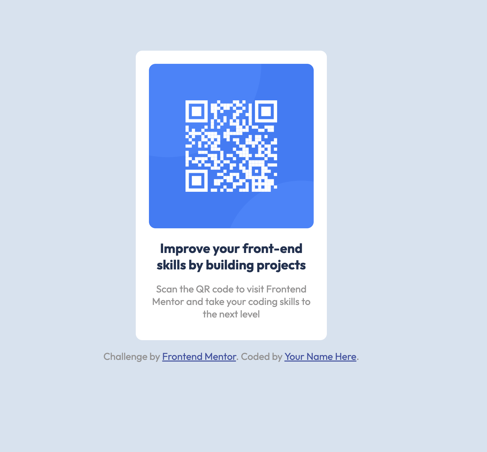

# Frontend Mentor - QR code component solution

This is a solution to the [QR code component challenge on Frontend Mentor](https://www.frontendmentor.io/challenges/qr-code-component-iux_sIO_H). Frontend Mentor challenges help you improve your coding skills by building realistic projects. 

## Table of contents

- [Overview](#overview)
  - [Screenshot](#screenshot)
  - [Links](#links)
- [My process](#my-process)
  - [Built with](#built-with)
  - [What I learned](#what-i-learned)
  - [Continued development](#continued-development)
  - [Useful resources](#useful-resources)
- [Author](#author)
- [Acknowledgments](#acknowledgments)

**Note: Delete this note and update the table of contents based on what sections you keep.**

## Overview

### Screenshot



### Links

- Solution URL: [Add solution URL here](https://github.com/sarachafikidrissi/Frontend-Mentor-Challenges-.git)
- Live Site URL: [Add live site URL here](https://your-live-site-url.com)

## My process

### Built with

- Semantic HTML5 markup
- CSS custom properties


### What I learned

While working on this project i have learnt how to use div's and style them correctly

To see how you can add code snippets, see below:

```html
<div class="container">

    <div class="qr-code">
        
    </div>

        <h1>Improve your front-end skills by building projects</h1>
        <p>
        Scan the QR code to visit Frontend Mentor and take your coding skills to the next level
    </p>
</div>
```
```css
.container {
    background-color: hsl(0, 0%, 100%);
    width: 250px;
    height: 400px;
    border-radius: 10px;
    padding: 20px;
    margin: 150px auto auto auto;
    
}
```

### Continued development

In the future i want to focus on how to use flexbox or css grid and master them so i can use them in my next projects


### Useful resources

- [stack overflow](https://stackoverflow.com/questions/10189356/how-to-add-screenshot-to-readmes-in-github-repository) - This helped me add a screenshot to my md file
- [Center an element](https://bootcamp.uxdesign.cc/5-simple-ways-to-center-a-div-horizontally-and-vertically-in-css-23bbaa5f9f52#:~:text=In%20conclusion%2C%20centering%20a%20div) - I leanrt from this how to center a div using diffrent ways.

## Author

- Frontend Mentor - [@sarachafikidrissi](https://www.frontendmentor.io/profile/sarachafikidrissi)
- Twitter - [@SaraChafikIdri1](https://twitter.com/SaraChafikIdri1)
